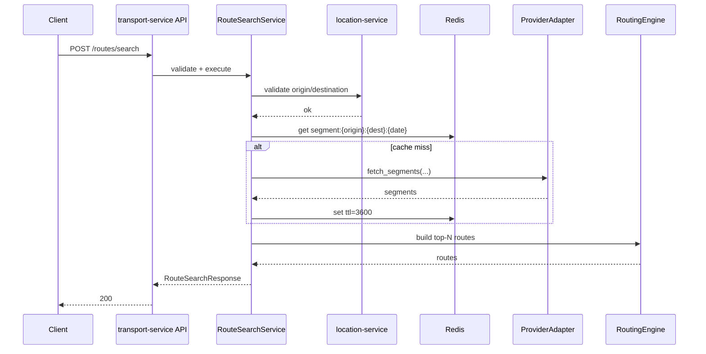
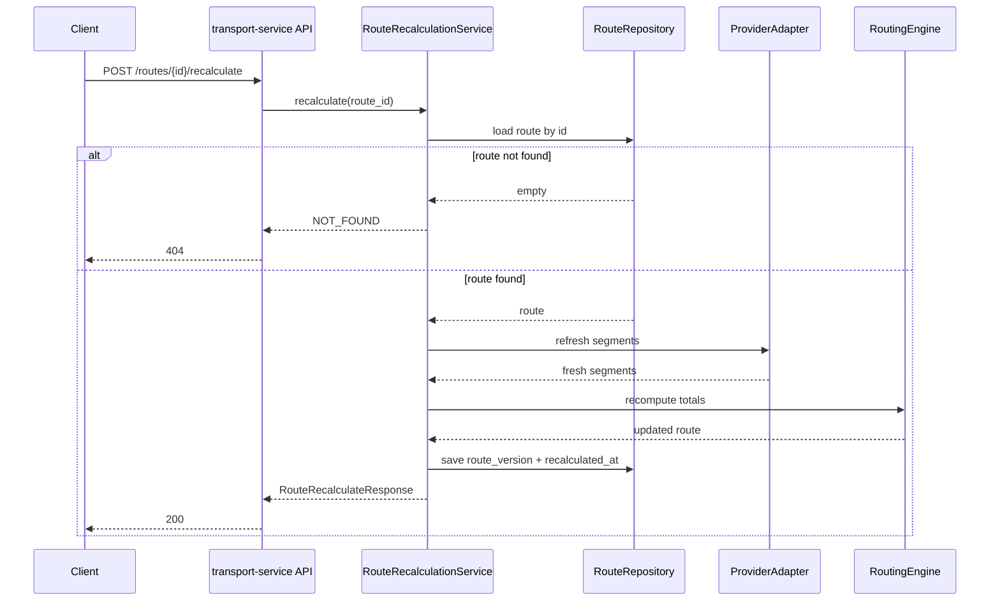
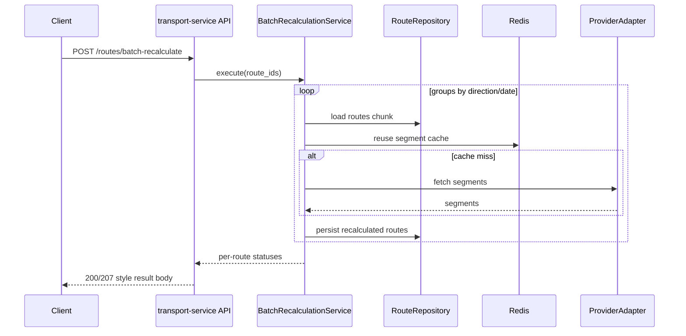

# Epic 01 Sequence Diagrams

## 1. Search Route

```mermaid
sequenceDiagram
    participant Client
    participant API as transport-service API
    participant App as RouteSearchService
    participant Loc as location-service
    participant Cache as Redis
    participant Provider as ProviderAdapter
    participant Engine as RoutingEngine

    Client->>API: POST /routes/search
    API->>App: validate + execute
    App->>Loc: validate origin/destination
    Loc-->>App: ok
    App->>Cache: get segment:{origin}:{dest}:{date}
    alt cache miss
        App->>Provider: fetch_segments(...)
        Provider-->>App: segments
        App->>Cache: set ttl=3600
    end
    App->>Engine: build top-N routes
    Engine-->>App: routes
    App-->>API: RouteSearchResponse
    API-->>Client: 200
```

## 2. Recalculate Route

```mermaid
sequenceDiagram
    participant Client
    participant API as transport-service API
    participant App as RouteRecalculationService
    participant Repo as RouteRepository
    participant Provider as ProviderAdapter
    participant Engine as RoutingEngine

    Client->>API: POST /routes/{id}/recalculate
    API->>App: recalculate(route_id)
    App->>Repo: load route by id
    alt route not found
        Repo-->>App: empty
        App-->>API: NOT_FOUND
        API-->>Client: 404
    else route found
        Repo-->>App: route
        App->>Provider: refresh segments
        Provider-->>App: fresh segments
        App->>Engine: recompute totals
        Engine-->>App: updated route
        App->>Repo: save route_version + recalculated_at
        App-->>API: RouteRecalculateResponse
        API-->>Client: 200
    end
```

## 3. Batch Recalculate

```mermaid
sequenceDiagram
    participant Client
    participant API as transport-service API
    participant Batch as BatchRecalculationService
    participant Repo as RouteRepository
    participant Cache as Redis
    participant Provider as ProviderAdapter

    Client->>API: POST /routes/batch-recalculate
    API->>Batch: execute(route_ids)
    loop groups by direction/date
        Batch->>Repo: load routes chunk
        Batch->>Cache: reuse segment cache
        alt cache miss
            Batch->>Provider: fetch segments
            Provider-->>Batch: segments
        end
        Batch->>Repo: persist recalculated routes
    end
    Batch-->>API: per-route statuses
    API-->>Client: 200/207 style result body
```

