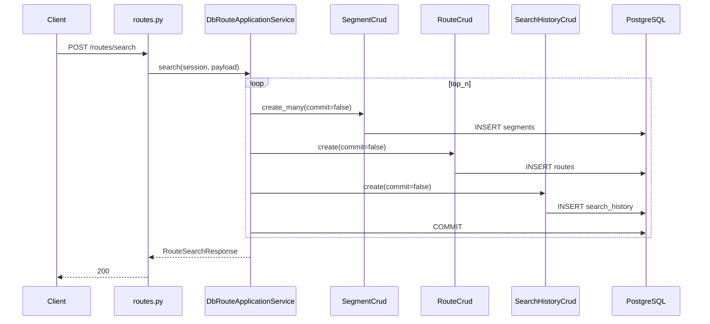
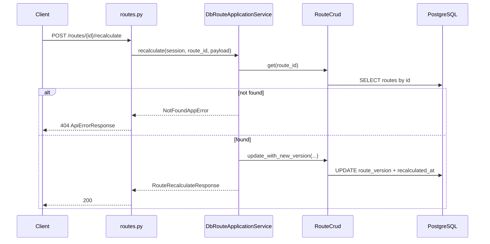
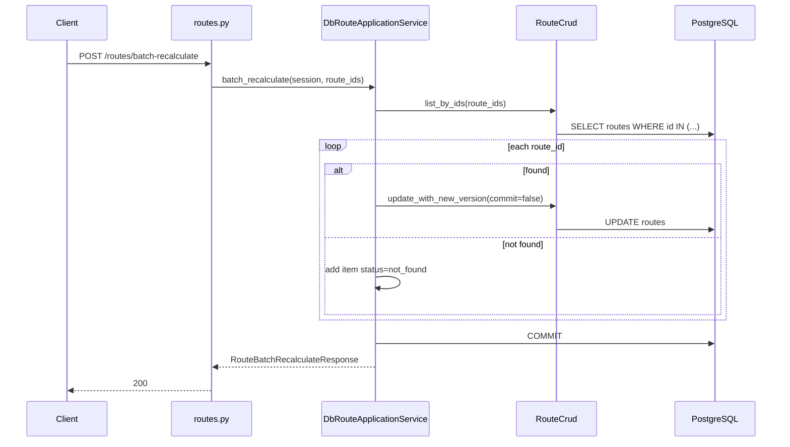

# Epic 02 Sequence Diagrams

## 1. Search with persistence

```mermaid
sequenceDiagram
    participant Client
    participant API as routes.py
    participant App as DbRouteApplicationService
    participant Seg as SegmentCrud
    participant Rt as RouteCrud
    participant Hist as SearchHistoryCrud
    participant DB as PostgreSQL

    Client->>API: POST /routes/search
    API->>App: search(session, payload)
    loop top_n
        App->>Seg: create_many(commit=false)
        Seg->>DB: INSERT segments
        App->>Rt: create(commit=false)
        Rt->>DB: INSERT routes
        App->>Hist: create(commit=false)
        Hist->>DB: INSERT search_history
        App->>DB: COMMIT
    end
    App-->>API: RouteSearchResponse
    API-->>Client: 200
```

## 2. Recalculate with route versioning

```mermaid
sequenceDiagram
    participant Client
    participant API as routes.py
    participant App as DbRouteApplicationService
    participant Rt as RouteCrud
    participant DB as PostgreSQL

    Client->>API: POST /routes/{id}/recalculate
    API->>App: recalculate(session, route_id, payload)
    App->>Rt: get(route_id)
    Rt->>DB: SELECT routes by id
    alt not found
        App-->>API: NotFoundAppError
        API-->>Client: 404 ApiErrorResponse
    else found
        App->>Rt: update_with_new_version(...)
        Rt->>DB: UPDATE route_version + recalculated_at
        App-->>API: RouteRecalculateResponse
        API-->>Client: 200
    end
```

## 3. Batch recalculate

```mermaid
sequenceDiagram
    participant Client
    participant API as routes.py
    participant App as DbRouteApplicationService
    participant Rt as RouteCrud
    participant DB as PostgreSQL

    Client->>API: POST /routes/batch-recalculate
    API->>App: batch_recalculate(session, route_ids)
    App->>Rt: list_by_ids(route_ids)
    Rt->>DB: SELECT routes WHERE id IN (...)
    loop each route_id
        alt found
            App->>Rt: update_with_new_version(commit=false)
            Rt->>DB: UPDATE routes
        else not found
            App->>App: add item status=not_found
        end
    end
    App->>DB: COMMIT
    App-->>API: RouteBatchRecalculateResponse
    API-->>Client: 200
```

