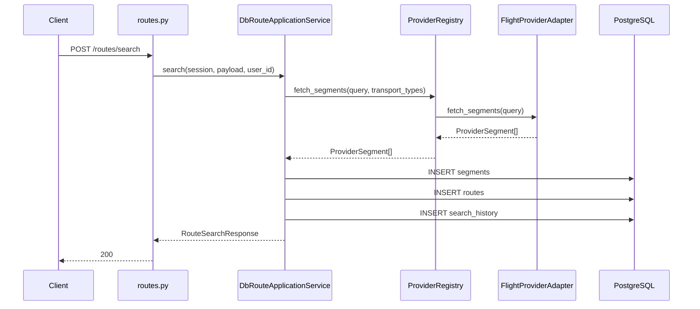
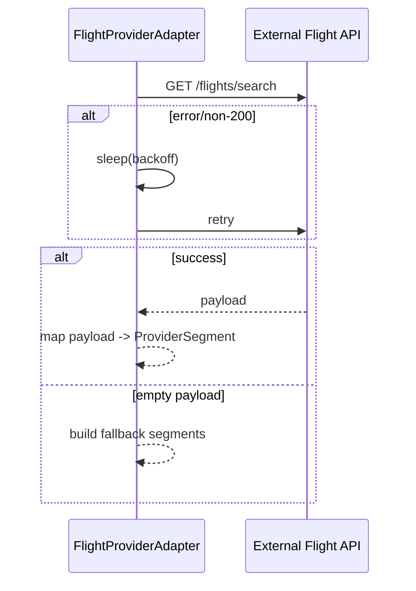
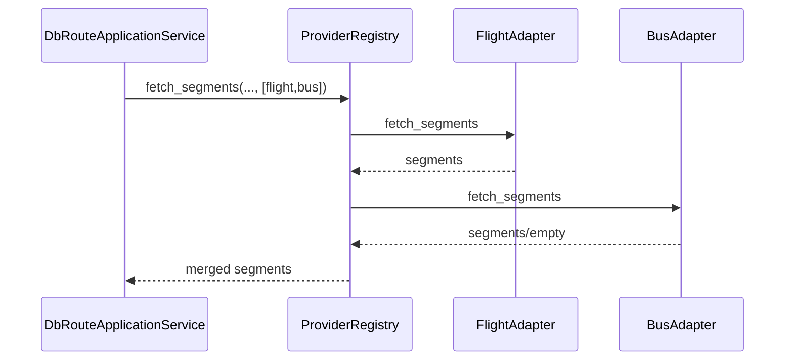

# Epic 03 Sequence Diagrams

## 1. Search via adapter layer

```mermaid
sequenceDiagram
    participant Client
    participant API as routes.py
    participant App as DbRouteApplicationService
    participant Reg as ProviderRegistry
    participant Flight as FlightProviderAdapter
    participant DB as PostgreSQL

    Client->>API: POST /routes/search
    API->>App: search(session, payload, user_id)
    App->>Reg: fetch_segments(query, transport_types)
    Reg->>Flight: fetch_segments(query)
    Flight-->>Reg: ProviderSegment[]
    Reg-->>App: ProviderSegment[]
    App->>DB: INSERT segments
    App->>DB: INSERT routes
    App->>DB: INSERT search_history
    App-->>API: RouteSearchResponse
    API-->>Client: 200
```

## 2. Flight adapter retry/backoff

```mermaid
sequenceDiagram
    participant Flight as FlightProviderAdapter
    participant Provider as External Flight API

    Flight->>Provider: GET /flights/search
    alt error/non-200
        Flight->>Flight: sleep(backoff)
        Flight->>Provider: retry
    end
    alt success
        Provider-->>Flight: payload
        Flight-->>Flight: map payload -> ProviderSegment
    else empty payload
        Flight-->>Flight: build fallback segments
    end
```

## 3. Multi-adapter selection

```mermaid
sequenceDiagram
    participant App as DbRouteApplicationService
    participant Reg as ProviderRegistry
    participant A1 as FlightAdapter
    participant A2 as BusAdapter

    App->>Reg: fetch_segments(..., [flight,bus])
    Reg->>A1: fetch_segments
    A1-->>Reg: segments
    Reg->>A2: fetch_segments
    A2-->>Reg: segments/empty
    Reg-->>App: merged segments
```

