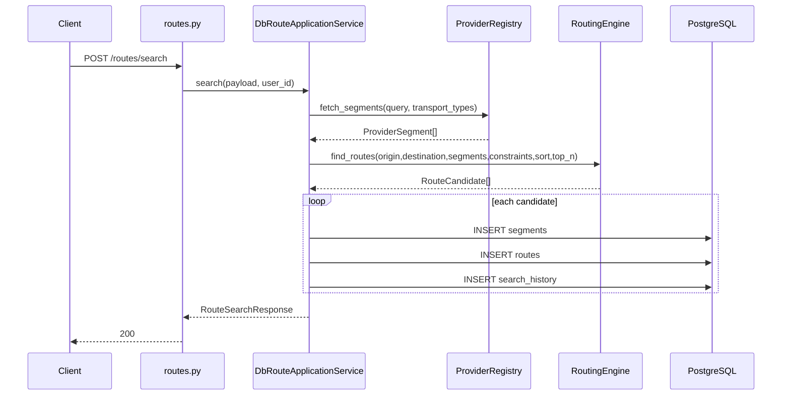
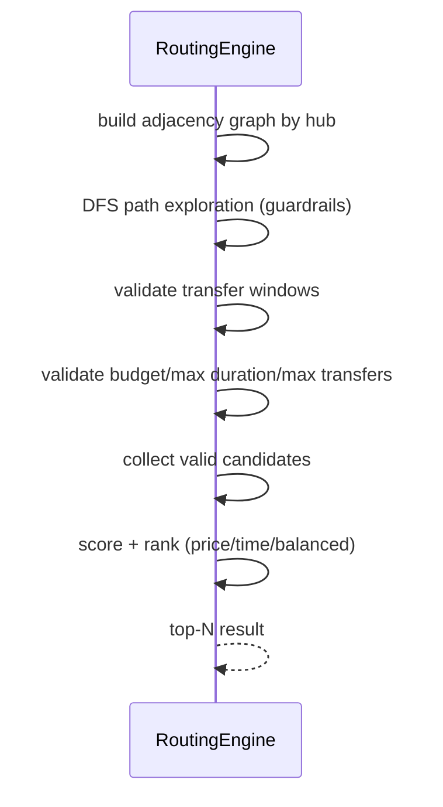
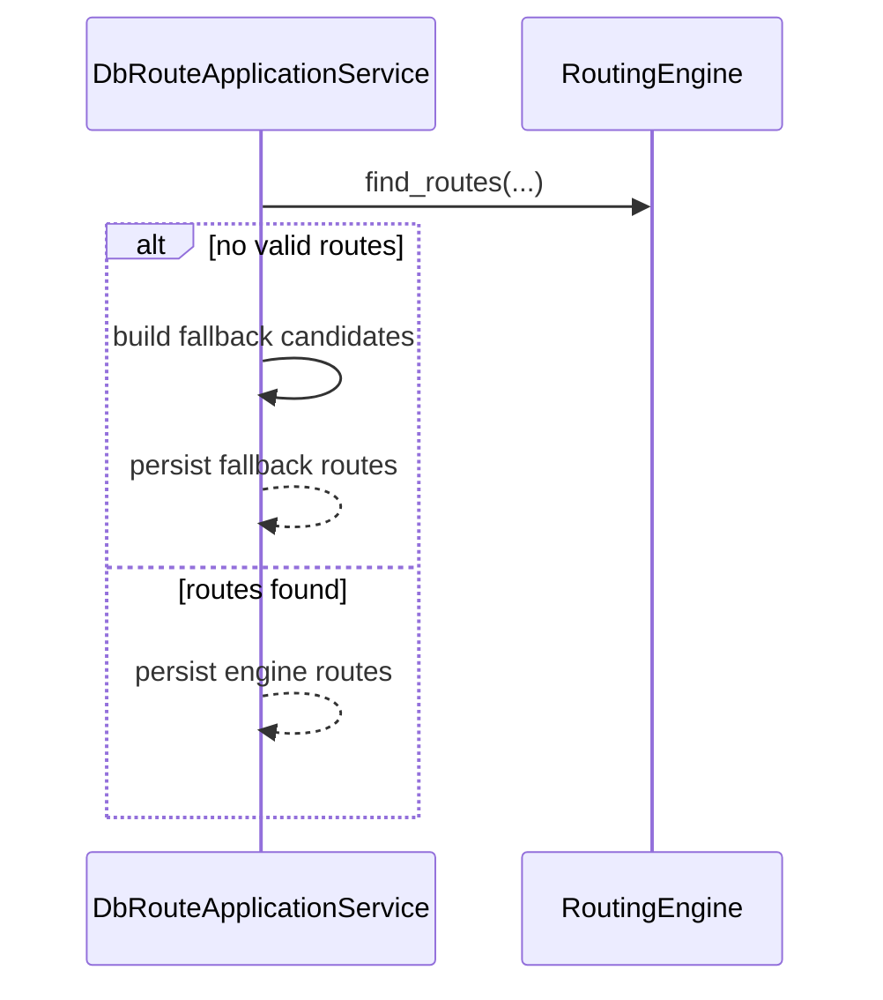

# Epic 04 Sequence Diagrams

## 1. Search with routing engine

```mermaid
sequenceDiagram
    participant Client
    participant API as routes.py
    participant App as DbRouteApplicationService
    participant Reg as ProviderRegistry
    participant Engine as RoutingEngine
    participant DB as PostgreSQL

    Client->>API: POST /routes/search
    API->>App: search(payload, user_id)
    App->>Reg: fetch_segments(query, transport_types)
    Reg-->>App: ProviderSegment[]
    App->>Engine: find_routes(origin,destination,segments,constraints,sort,top_n)
    Engine-->>App: RouteCandidate[]
    loop each candidate
        App->>DB: INSERT segments
        App->>DB: INSERT routes
        App->>DB: INSERT search_history
    end
    App-->>API: RouteSearchResponse
    API-->>Client: 200
```

## 2. Routing constraints evaluation

```mermaid
sequenceDiagram
    participant Engine as RoutingEngine

    Engine->>Engine: build adjacency graph by hub
    Engine->>Engine: DFS path exploration (guardrails)
    Engine->>Engine: validate transfer windows
    Engine->>Engine: validate budget/max duration/max transfers
    Engine->>Engine: collect valid candidates
    Engine->>Engine: score + rank (price/time/balanced)
    Engine-->>Engine: top-N result
```

## 3. Fallback flow

```mermaid
sequenceDiagram
    participant App as DbRouteApplicationService
    participant Engine as RoutingEngine

    App->>Engine: find_routes(...)
    alt no valid routes
        App->>App: build fallback candidates
        App-->>App: persist fallback routes
    else routes found
        App-->>App: persist engine routes
    end
```

