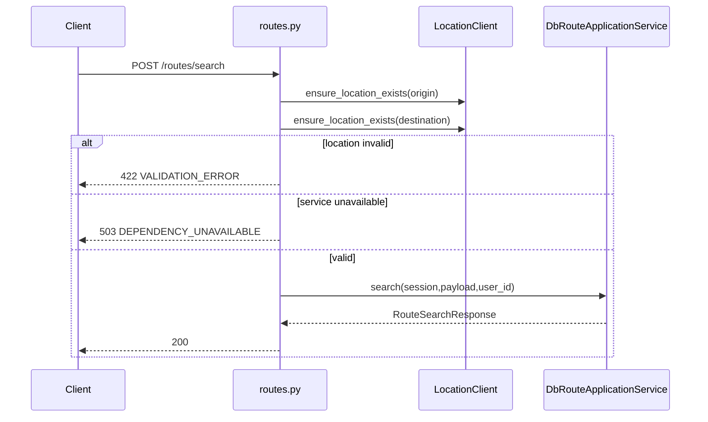
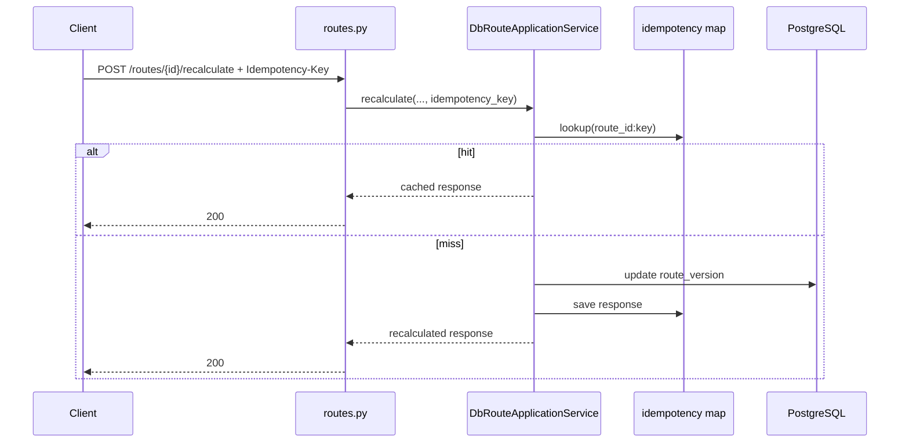
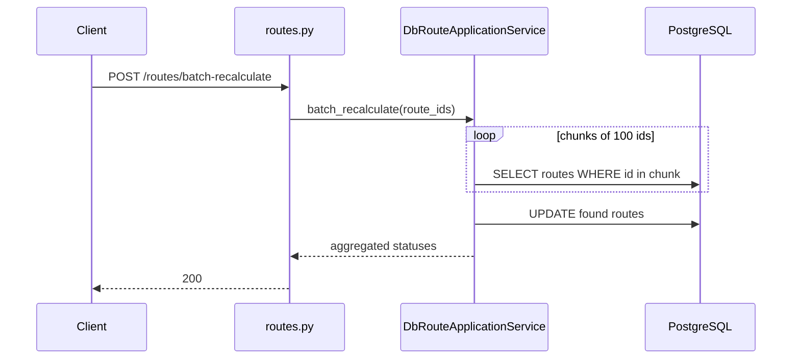

# Epic 05 Sequence Diagrams

## 1. Search API with location validation

```mermaid
sequenceDiagram
    participant Client
    participant API as routes.py
    participant Loc as LocationClient
    participant App as DbRouteApplicationService

    Client->>API: POST /routes/search
    API->>Loc: ensure_location_exists(origin)
    API->>Loc: ensure_location_exists(destination)
    alt location invalid
        API-->>Client: 422 VALIDATION_ERROR
    else service unavailable
        API-->>Client: 503 DEPENDENCY_UNAVAILABLE
    else valid
        API->>App: search(session,payload,user_id)
        App-->>API: RouteSearchResponse
        API-->>Client: 200
    end
```

## 2. Recalculate with idempotency key

```mermaid
sequenceDiagram
    participant Client
    participant API as routes.py
    participant App as DbRouteApplicationService
    participant Cache as idempotency map
    participant DB as PostgreSQL

    Client->>API: POST /routes/{id}/recalculate + Idempotency-Key
    API->>App: recalculate(..., idempotency_key)
    App->>Cache: lookup(route_id:key)
    alt hit
        App-->>API: cached response
        API-->>Client: 200
    else miss
        App->>DB: update route_version
        App->>Cache: save response
        App-->>API: recalculated response
        API-->>Client: 200
    end
```

## 3. Batch chunked processing

```mermaid
sequenceDiagram
    participant Client
    participant API as routes.py
    participant App as DbRouteApplicationService
    participant DB as PostgreSQL

    Client->>API: POST /routes/batch-recalculate
    API->>App: batch_recalculate(route_ids)
    loop chunks of 100 ids
        App->>DB: SELECT routes WHERE id in chunk
    end
    App->>DB: UPDATE found routes
    App-->>API: aggregated statuses
    API-->>Client: 200
```

