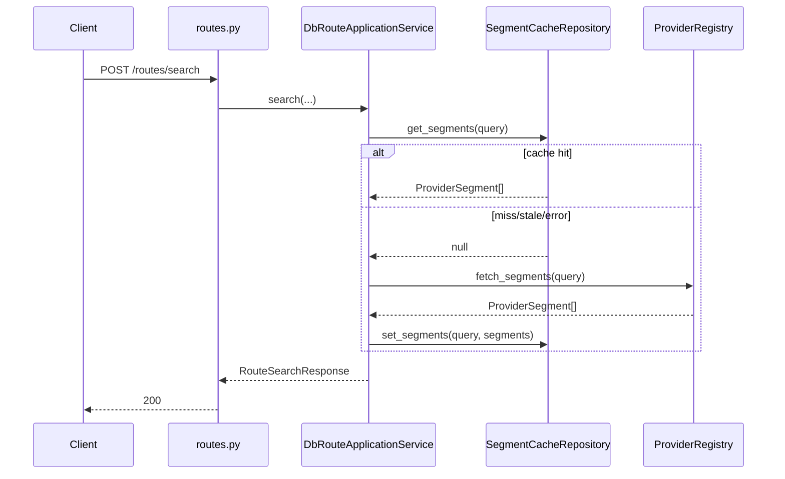
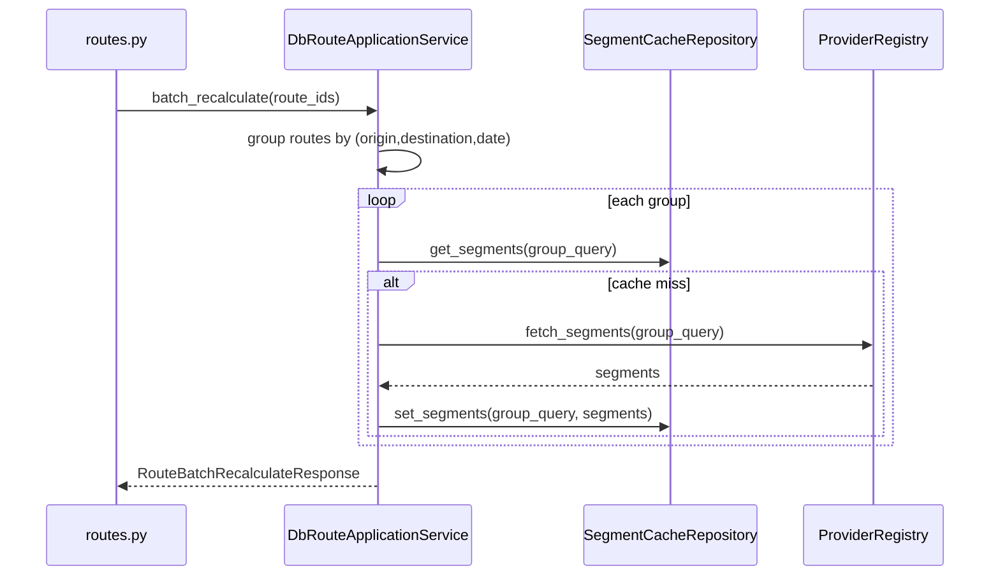
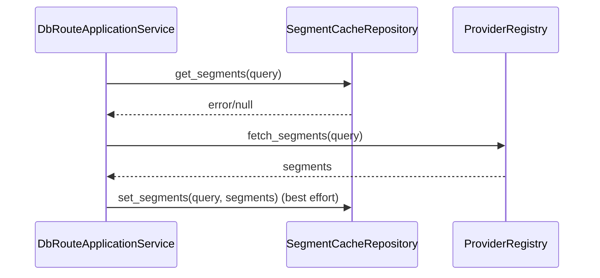

# Epic 06 Sequence Diagrams

## 1. Search with cache-aside

```mermaid
sequenceDiagram
    participant Client
    participant API as routes.py
    participant App as DbRouteApplicationService
    participant Cache as SegmentCacheRepository
    participant Provider as ProviderRegistry

    Client->>API: POST /routes/search
    API->>App: search(...)
    App->>Cache: get_segments(query)
    alt cache hit
        Cache-->>App: ProviderSegment[]
    else miss/stale/error
        Cache-->>App: null
        App->>Provider: fetch_segments(query)
        Provider-->>App: ProviderSegment[]
        App->>Cache: set_segments(query, segments)
    end
    App-->>API: RouteSearchResponse
    API-->>Client: 200
```

## 2. Batch recalculate with cache warm-up

```mermaid
sequenceDiagram
    participant API as routes.py
    participant App as DbRouteApplicationService
    participant Cache as SegmentCacheRepository
    participant Provider as ProviderRegistry

    API->>App: batch_recalculate(route_ids)
    App->>App: group routes by (origin,destination,date)
    loop each group
        App->>Cache: get_segments(group_query)
        alt cache miss
            App->>Provider: fetch_segments(group_query)
            Provider-->>App: segments
            App->>Cache: set_segments(group_query, segments)
        end
    end
    App-->>API: RouteBatchRecalculateResponse
```

## 3. Redis failure fallback

```mermaid
sequenceDiagram
    participant App as DbRouteApplicationService
    participant Cache as SegmentCacheRepository
    participant Provider as ProviderRegistry

    App->>Cache: get_segments(query)
    Cache-->>App: error/null
    App->>Provider: fetch_segments(query)
    Provider-->>App: segments
    App->>Cache: set_segments(query, segments) (best effort)
```

