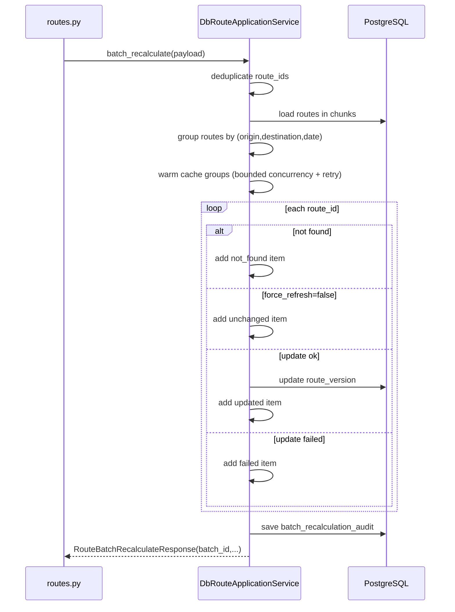
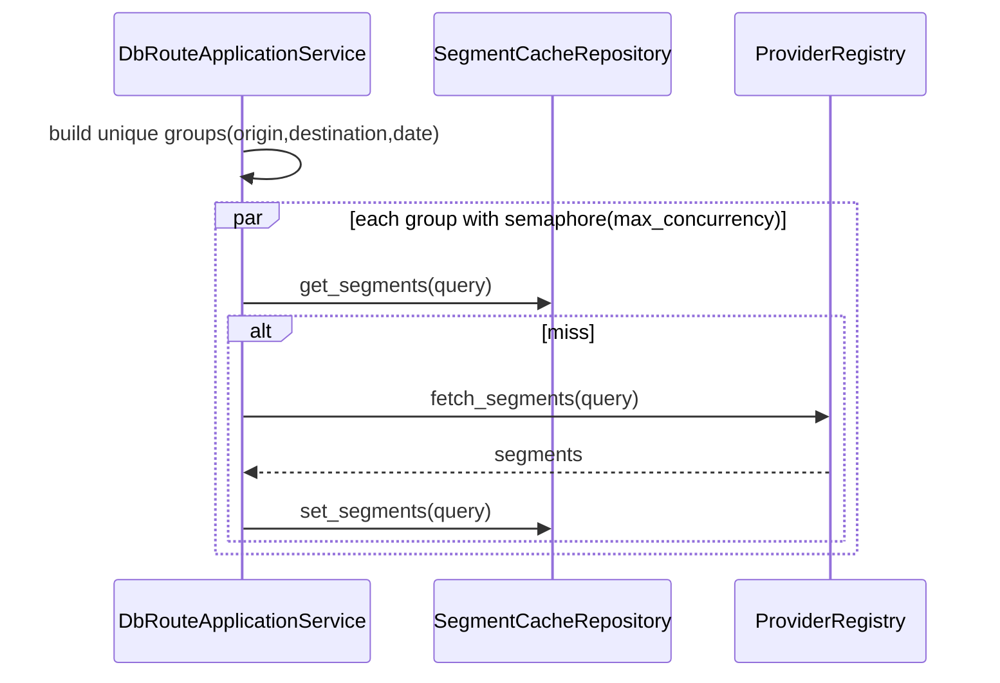
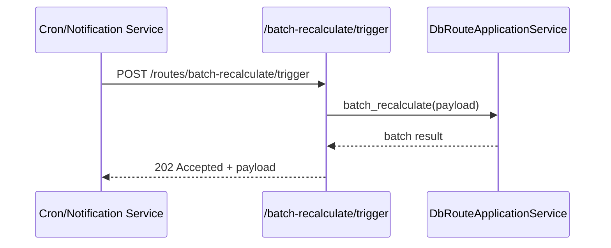

# Epic 07 Sequence Diagrams

## 1. Batch orchestration

```mermaid
sequenceDiagram
    participant API as routes.py
    participant App as DbRouteApplicationService
    participant DB as PostgreSQL

    API->>App: batch_recalculate(payload)
    App->>App: deduplicate route_ids
    App->>DB: load routes in chunks
    App->>App: group routes by (origin,destination,date)
    App->>App: warm cache groups (bounded concurrency + retry)
    loop each route_id
        alt not found
            App->>App: add not_found item
        else force_refresh=false
            App->>App: add unchanged item
        else update ok
            App->>DB: update route_version
            App->>App: add updated item
        else update failed
            App->>App: add failed item
        end
    end
    App->>DB: save batch_recalculation_audit
    App-->>API: RouteBatchRecalculateResponse(batch_id,...)
```

## 2. Cache warm-up by groups

```mermaid
sequenceDiagram
    participant App as DbRouteApplicationService
    participant Cache as SegmentCacheRepository
    participant Provider as ProviderRegistry

    App->>App: build unique groups(origin,destination,date)
    par each group with semaphore(max_concurrency)
        App->>Cache: get_segments(query)
        alt miss
            App->>Provider: fetch_segments(query)
            Provider-->>App: segments
            App->>Cache: set_segments(query)
        end
    end
```

## 3. External trigger endpoint

```mermaid
sequenceDiagram
    participant Cron as Cron/Notification Service
    participant API as /batch-recalculate/trigger
    participant App as DbRouteApplicationService

    Cron->>API: POST /routes/batch-recalculate/trigger
    API->>App: batch_recalculate(payload)
    App-->>API: batch result
    API-->>Cron: 202 Accepted + payload
```

