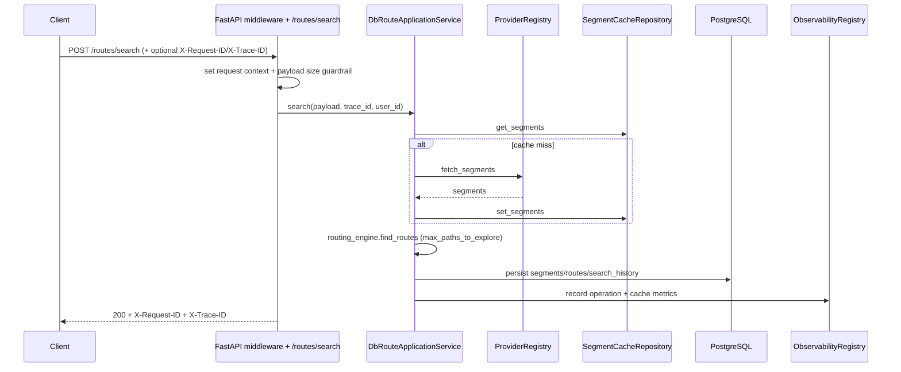
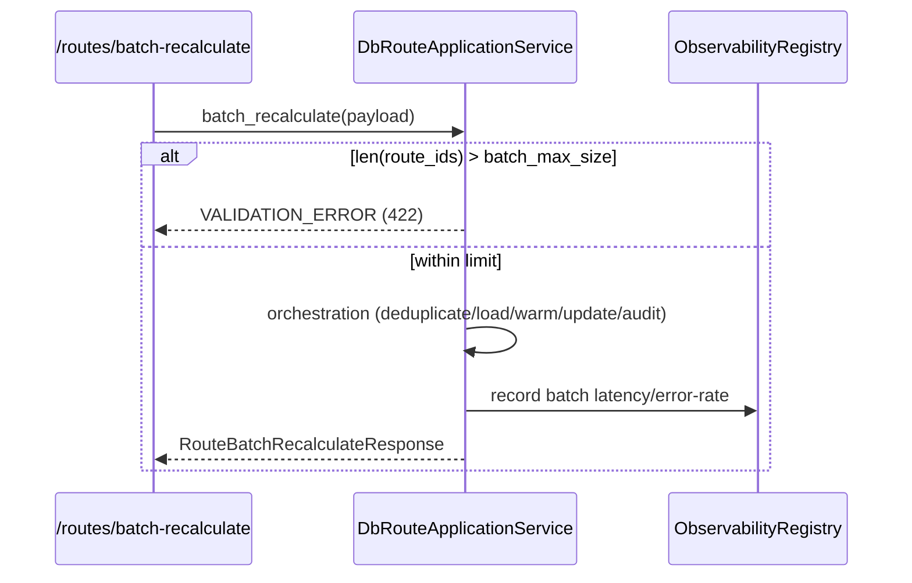
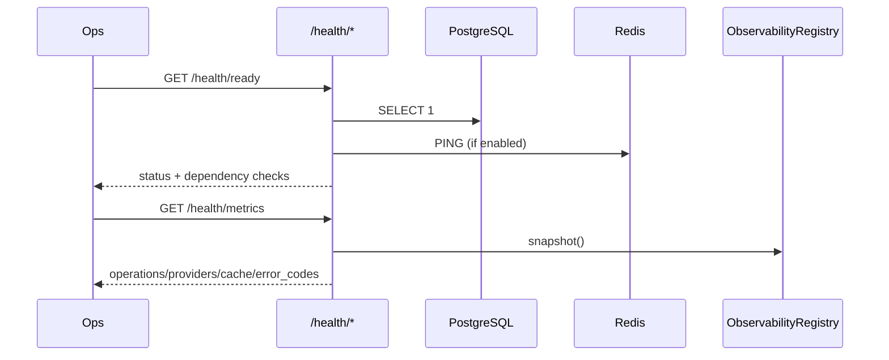

# Epic 08 Sequence Diagrams

## 1. Search with correlation, metrics and guardrails

```mermaid
sequenceDiagram
    participant Client
    participant API as FastAPI middleware + /routes/search
    participant App as DbRouteApplicationService
    participant Providers as ProviderRegistry
    participant Cache as SegmentCacheRepository
    participant DB as PostgreSQL
    participant Obs as ObservabilityRegistry

    Client->>API: POST /routes/search (+ optional X-Request-ID/X-Trace-ID)
    API->>API: set request context + payload size guardrail
    API->>App: search(payload, trace_id, user_id)
    App->>Cache: get_segments
    alt cache miss
        App->>Providers: fetch_segments
        Providers-->>App: segments
        App->>Cache: set_segments
    end
    App->>App: routing_engine.find_routes (max_paths_to_explore)
    App->>DB: persist segments/routes/search_history
    App->>Obs: record operation + cache metrics
    API-->>Client: 200 + X-Request-ID + X-Trace-ID
```

## 2. Batch guardrail + observability

```mermaid
sequenceDiagram
    participant API as /routes/batch-recalculate
    participant App as DbRouteApplicationService
    participant Obs as ObservabilityRegistry

    API->>App: batch_recalculate(payload)
    alt len(route_ids) > batch_max_size
        App-->>API: VALIDATION_ERROR (422)
    else within limit
        App->>App: orchestration (deduplicate/load/warm/update/audit)
        App->>Obs: record batch latency/error-rate
        App-->>API: RouteBatchRecalculateResponse
    end
```

## 3. Readiness and metrics

```mermaid
sequenceDiagram
    participant Ops
    participant Health as /health/*
    participant DB as PostgreSQL
    participant Redis
    participant Obs as ObservabilityRegistry

    Ops->>Health: GET /health/ready
    Health->>DB: SELECT 1
    Health->>Redis: PING (if enabled)
    Health-->>Ops: status + dependency checks

    Ops->>Health: GET /health/metrics
    Health->>Obs: snapshot()
    Health-->>Ops: operations/providers/cache/error_codes
```

